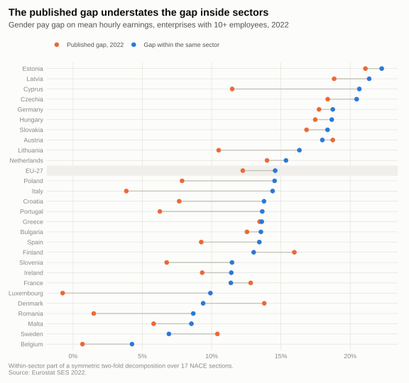
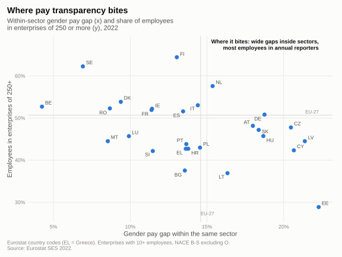
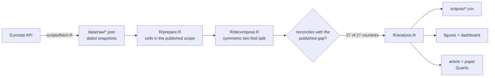

# Where pay transparency bites

From June 2027, every EU employer with 250 or more workers must publish its gender pay gap every
year. The benchmark everyone reaches for is the national gap Eurostat publishes. **This project
shows why that benchmark flatters**: split across sectors, the 2022 gap is wider inside sectors
than in the headline in 22 of the 27 Member States, most of all where the headline is small, and
it is wider still in the large employers that report first.

[](https://github.com/D0M3N1C0X/where-pay-transparency-bites/actions/workflows/ci.yml)


### ▶ [Read the article](https://d0m3n1c0x.github.io/where-pay-transparency-bites/) · [Open the dashboard](https://d0m3n1c0x.github.io/where-pay-transparency-bites/dashboard/) · [Working paper (PDF)](https://d0m3n1c0x.github.io/where-pay-transparency-bites/paper.pdf)

---

## What it finds

| | |
|---|---|
| **The published EU gap was 12.2% in 2022; inside the same sector it was 14.6%.** Women are over-represented in sectors that pay above average, such as education and health, which lowers the national figure. | **The lowest headlines hide the most.** Italy publishes 3.8% and has 14.4% within sectors; Poland 7.9% against 14.5%; Romania 1.5% against 8.7%. |
| **Half of the workforce is in the first wave.** 51% of employees in enterprises with 10+ staff work for one with 250 or more, which report every year from 7 June 2027. | **The gap is wider where reporting is annual.** In all 6 countries with complete earnings by enterprise size, the gap is larger in enterprises of 250+: 14.0% against 0.8% in Poland. |





---

## What you get

| Output | For | What is in it |
|---|---|---|
| [Article](https://d0m3n1c0x.github.io/where-pay-transparency-bites/) | HR, reward and legal teams | The findings in eight sections, answer first, with what employers should do before June 2027. |
| [Dashboard](https://d0m3n1c0x.github.io/where-pay-transparency-bites/dashboard/) | anyone | One HTML file: pick a country and see its gap over time, its sector by sector decomposition, its exposure to annual reporting, and its public/private and age breakdowns. |
| [Working paper](https://d0m3n1c0x.github.io/where-pay-transparency-bites/paper.pdf) | researchers and reviewers | Data, method, results, robustness checks, limitations and a full country table. |
| [`outputs/`](outputs/) | analysts | Every result as a tidy CSV. |
| [`docs/sources.md`](docs/sources.md) | reviewers | The source and status of every statement that does not come from the code. |

## How it works



- **Scope as published.** Enterprises with 10+ employees, NACE sections B to S excluding O, mean
  gross hourly earnings: the definition behind Eurostat's gap.
- **A split that adds up.** The 2022 gap is divided over 17 sectors into "where women and men
  work" and "how they are paid there", with averaged weights, so the two parts sum exactly to the
  gap and do not depend on whose pay is the yardstick. The one-sided Oaxaca-Blinder splits are
  reported as robustness checks.
- **Nothing is used unless it reconciles.** A country enters only if its cells cover 95% of each
  sex's employees and rebuild the published gap within 0.5 points. Sector cells pass for all 27
  countries (largest difference 0.42 points); finer cells, where Eurostat suppresses data, only for
  some.
- **EU figures the way Eurostat makes them.** The EU gap is the employee-weighted mean of national
  gaps (12.2%); pooling EU earnings would give 13.2%.
- **No number typed by hand.** The article and the paper take every figure from the code; the test
  suite checks the paper's abstract and this README's headline claims against it.

## Run it

Requires R 4.6 and Quarto 1.10.

```r
renv::restore()                 # the exact package versions in renv.lock
```

```bash
Rscript tests/testthat.R        # decomposition identities and reconciliation
Rscript scripts/build.R         # outputs/, figures/, dashboard/index.html
quarto render                   # article and working paper into _site/
Rscript scripts/fetch.R         # optional: refresh the Eurostat snapshots
```

On macOS 13, Quarto's bundled Sass compiler does not start; point `QUARTO_DART_SASS` at the npm
`sass` package in a git-ignored `_environment.local`.

## What's inside

```
├── data/raw/            Eurostat snapshots, with address and retrieval date
├── R/
│   ├── eurostat.R       API access and JSON-stat parsing
│   ├── prepare.R        cells, totals and size classes in the published scope
│   ├── decompose.R      the two-fold decomposition and the EU aggregate
│   ├── analysis.R       run_analysis(): every result in one place
│   ├── numbers.R        the figures quoted in the text
│   ├── figures.R        every chart
│   └── theme.R          validated palette and chart style
├── scripts/             fetch.R, build.R
├── article/             the article (Quarto, HTML)
├── paper/               the working paper (Quarto, Typst PDF) and its bibliography
├── dashboard/           template.html and the built single-file dashboard
├── outputs/             results as CSV
├── figures/             README charts (SVG)
├── docs/sources.md      verification register
└── tests/testthat/      unit, reconciliation and text tests
```

## Cite

See [`CITATION.cff`](CITATION.cff). A DOI is minted on Zenodo for each release.

## About

Built by **Domenico Perroni** — HR advisory, people analytics and media education, based in Kraków.
[GitHub profile](https://github.com/D0M3N1C0X) · [LinkedIn](https://www.linkedin.com/in/domenico-perroni) · [ORCID](https://orcid.org/0009-0001-8806-5188)

**More from the same portfolio**

- [pay-transparency-readiness-kit](https://github.com/D0M3N1C0X/pay-transparency-readiness-kit) — the employer's side of the same Directive: a live Excel model reconciled with pandas, a board briefing and a readiness checklist, with the [report online](https://d0m3n1c0x.github.io/pay-transparency-readiness-kit/)
- [workforce-cost-model](https://github.com/D0M3N1C0X/workforce-cost-model) — the people budget of the organisation in hr-people-analytics: Italian and Polish employer costs, the FY2026 budget variance and FY2027 scenarios in a live Excel model reconciled with pandas, with the [memo online](https://d0m3n1c0x.github.io/workforce-cost-model/)
- [hr-people-analytics](https://github.com/D0M3N1C0X/hr-people-analytics) — attrition drivers, EU pay-transparency exposure and HR service-desk performance on a synthetic 4,000-employee organisation, with the [report online](https://d0m3n1c0x.github.io/hr-people-analytics/)
- [engagement-survey-analytics](https://github.com/D0M3N1C0X/engagement-survey-analytics) — an employee engagement survey analysed end to end, with a [live dashboard](https://d0m3n1c0x.github.io/engagement-survey-analytics/) you can filter in the browser
- [job-search-agent](https://github.com/D0M3N1C0X/job-search-agent) — a job search run as a pipeline: public ATS board APIs, explainable fit scoring, funnel analytics
- [pompei-stratificata](https://github.com/D0M3N1C0X/pompei-stratificata) — Pompeii and Herculaneum from AD 79 to today, a [walkable model](https://d0m3n1c0x.github.io/pompei-stratificata/) with a sourced documentary dossier, in six languages

Code under the MIT licence; article, paper, figures and tables under CC BY 4.0
([LICENSE-CONTENT.md](LICENSE-CONTENT.md)). Data: Eurostat.
